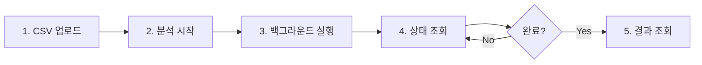

# 전해탈지 공정 품질 예측 API

경북대학교 종합설계프로젝트2 - 머신러닝 제조 분야 적용 연구(데이터 분석 및 시각화) 백엔드

**참여 기업**: 초록에이아이
**팀원**: 정유현, 이미진, 곽민서

## 📋 프로젝트 개요

전해탈지 공정의 센서 데이터(온도, 습도, 압력)를 분석하여 불량 여부를 예측하고, 안전한 공정 운영 범위를 추정하는 머신러닝 기반 품질 관리 시스템입니다.

### 주요 기능

- 📊 센서 데이터 업로드 및 전처리
- 🤖 RandomForest 기반 불량 예측 모델
- 📈 데이터 품질 평가 (CQI, UQI, VQI, DQI)
- 🎯 안전 공정 범위 추정
- 📉 시각화 및 EDA 리포트 생성
- 🔍 실시간 분석 상태 모니터링

## 🏗️ 프로젝트 구조

```
capstone2_BE/
├── app/
│   ├── main.py                 # FastAPI 애플리케이션 진입점
│   ├── api/
│   │   └── v1/
│   │       └── qc.py           # 품질 관리 API 엔드포인트
│   ├── services/
│   │   ├── ml_service.py       # ML 결과 파일 로딩
│   │   ├── data_service.py     # CSV 업로드 및 처리
│   │   └── analysis_service.py # 전체 분석 파이프라인
│   ├── analysis/
│   │   ├── preprocessing.py    # 데이터 전처리 및 정제
│   │   ├── evaluation.py       # 품질 평가 및 안전 영역 추정
│   │   ├── model_training.py   # 모델 학습 및 평가
│   │   └── visualization.py    # 시각화 및 리포트
│   └── models/
│       └── responses.py        # 응답 모델
├── data/                       # 업로드된 CSV 파일
├── artifacts/                  # 분석 결과 및 모델 파일
├── requirement.txt             # Python 의존성
├── CLAUDE.md                   # Claude Code 가이드
└── README.md                   # 프로젝트 문서
```

## 🚀 시작하기

### 1. 환경 설정

```bash
# 가상환경 생성 및 활성화
python -m venv .venv
source .venv/bin/activate  # Windows: .venv\Scripts\activate

# 의존성 설치
pip install -r requirement.txt
```

### 2. 서버 실행

```bash
# 개발 서버 (자동 리로드)
uvicorn app.main:app --reload

# 프로덕션 서버
uvicorn app.main:app --host 0.0.0.0 --port 8000
```

서버가 시작되면 다음 주소로 접속할 수 있습니다:
- API: http://localhost:8000
- API 문서: http://localhost:8000/docs
- 대체 문서: http://localhost:8000/redoc

## 📡 API 사용법

### 전체 분석 프로세스



### 1. CSV 파일 업로드

센서 데이터 CSV 파일을 업로드합니다.

```bash
curl -X POST "http://localhost:8000/api/v1/upload-csv" \
  -H "Content-Type: multipart/form-data" \
  -F "file=@sensor_data.csv"
```

**응답 예시:**
```json
{
  "message": "파일 업로드 성공",
  "filename": "sensor_data.csv",
  "analysis": {
    "saved_path": "data/uploaded_20251125_120000_sensor_data.csv",
    "is_sensor_file": true,
    "row_count": 1000,
    "column_count": 4,
    "sensor_file_info": {
      "sensor_file_count": 3,
      "sensor_files": ["file1.csv", "file2.csv", "file3.csv"]
    }
  }
}
```

### 2. 분석 시작

전체 분석 파이프라인을 백그라운드에서 실행합니다.

```bash
curl -X POST "http://localhost:8000/api/v1/start-analysis"
```

**응답:**
```json
{
  "message": "분석이 시작되었습니다.",
  "status": "running"
}
```

### 3. 분석 상태 확인

분석 진행 상태와 결과를 조회합니다.

```bash
curl "http://localhost:8000/api/v1/analysis-status"
```

**응답 (실행 중):**
```json
{
  "status": "running",
  "result": null
}
```

**응답 (완료):**
```json
{
  "status": "completed",
  "result": {
    "status": "success",
    "data_summary": {
      "original_rows": 10970,
      "cleaned_rows": 10500,
      "removed_rows": 470
    },
    "quality": {
      "overall_dqi": 97.59
    },
    "model": {
      "accuracy": 0.9857,
      "precision": 0.9823,
      "recall": 0.9891,
      "f1_score": 0.9857,
      "auc": 0.9856
    },
    "safe_region": {
      "temp_min": 20.0,
      "temp_max": 75.0,
      "humid_min": 30.0,
      "humid_max": 85.0,
      "press_min": 920.0,
      "press_max": 1080.0
    },
    "artifacts": {
      "cleaned_data": "artifacts/cleaned_data.csv",
      "model_file": "artifacts/model_randomforest.joblib",
      "eda_dir": "artifacts/eda"
    }
  }
}
```

### 4. 상세 결과 조회

#### 특성 중요도
```bash
curl "http://localhost:8000/api/v1/feature-importance"
```

#### 혼동 행렬
```bash
curl "http://localhost:8000/api/v1/confusion-matrix"
```

#### 분류 리포트
```bash
curl "http://localhost:8000/api/v1/classification-report-rf"
```

#### 안전 영역
```bash
curl "http://localhost:8000/api/v1/safe-region"
```

## 🔬 분석 파이프라인

전체 분석 프로세스는 다음 단계로 진행됩니다:

### 1. 데이터 전처리
- CSV 파일 안전 읽기 (다중 인코딩 지원)
- 컬럼명 정규화
- 센서 데이터 병합

### 2. 데이터 정제
- 결측치 처리 (제거 또는 대체)
- Z-score 기반 이상치 제거 (임계값: 3.0)
- 데이터 품질 검증

### 3. 데이터 품질 평가
- **CQI** (Completeness Quality Index): 완전성
- **UQI** (Uniqueness Quality Index): 고유성
- **VQI** (Validity Quality Index): 유효성
- **DQI** (Data Quality Index): 종합 품질 지수

### 4. 탐색적 데이터 분석 (EDA)
- 히스토그램 (분포 확인)
- 상관관계 히트맵
- 박스플롯 (이상치 확인)
- 라벨 분포 시각화

### 5. 모델 학습 및 평가
- **모델**: RandomForest Classifier (200 trees)
- **특성**: 온도(temp), 습도(humid), 압력(press)
- **평가 지표**: Accuracy, Precision, Recall, F1-score, AUC
- **데이터 분할**: 80% 학습, 20% 테스트

### 6. 안전 영역 추정
- 불량 확률 < 5%인 공정 조건 탐색
- 격자 탐색 기반 안전 범위 추정
- 온도, 습도, 압력의 최적 운영 범위 도출

## 📊 생성되는 결과물

### CSV 파일
- `cleaned_data.csv` - 정제된 데이터
- `metrics_randomforest.csv` - 모델 평가 지표
- `feature_importance_randomforest.csv` - 특성 중요도
- `confusion_matrix_randomforest.csv` - 혼동 행렬
- `test_predictions_randomforest.csv` - 테스트 예측 결과

### JSON 파일
- `classification_report_randomforest.json` - 분류 리포트
- `metrics_summary_randomforest.json` - 성능 요약
- `safe_region_result.json` - 안전 영역 추정 결과

### 이미지 파일
- `histogram.png` - 데이터 분포
- `correlation_heatmap.png` - 상관관계
- `boxplot.png` - 박스플롯
- `label_distribution.png` - 라벨 분포
- `confusion_matrix_randomforest.png` - 혼동 행렬
- `roc_curve_randomforest.png` - ROC 곡선
- `pr_curve_randomforest.png` - Precision-Recall 곡선
- `feature_importance_randomforest.png` - 특성 중요도

### 모델 파일
- `model_randomforest.joblib` - 학습된 RandomForest 모델
- `scaler.joblib` - StandardScaler

## 🛠️ 기술 스택

- **Framework**: FastAPI 0.121.2
- **ML/DL**: scikit-learn, TensorFlow, AutoKeras
- **Data**: pandas, numpy, scipy
- **Visualization**: matplotlib, seaborn
- **Python**: 3.13

## 📝 API 엔드포인트 목록

| Method | Endpoint | 설명 |
|--------|----------|------|
| POST | `/api/v1/upload-csv` | CSV 파일 업로드 |
| GET | `/api/v1/sensor-files` | 센서 파일 정보 조회 |
| POST | `/api/v1/start-analysis` | 분석 시작 |
| GET | `/api/v1/analysis-status` | 분석 상태 조회 |
| GET | `/api/v1/feature-importance` | 특성 중요도 조회 |
| GET | `/api/v1/confusion-matrix` | 혼동 행렬 조회 |
| GET | `/api/v1/classification-report-rf` | 분류 리포트 조회 |
| GET | `/api/v1/safe-region` | 안전 영역 조회 |
| GET | `/health` | 헬스 체크 |

## 🔧 설정

### 환경 변수
환경 변수는 `.env` 파일에 설정할 수 있습니다 (현재는 사용하지 않음).

### 디렉토리
- `data/`: 업로드된 CSV 파일 저장
- `artifacts/`: 분석 결과 및 모델 파일 저장

## 📄 라이선스

이 프로젝트는 경북대학교 종합설계프로젝트의 일환으로 개발되었습니다.

## 👥 기여자

- 정유현
- 이미진
- 곽민서

**참여 기업**: 초록에이아이

---

**Note**: 이 API는 전해탈지 공정의 품질 관리를 위한 연구 프로젝트입니다. 프로덕션 환경에서 사용 시 추가적인 보안 및 성능 최적화가 필요할 수 있습니다.
