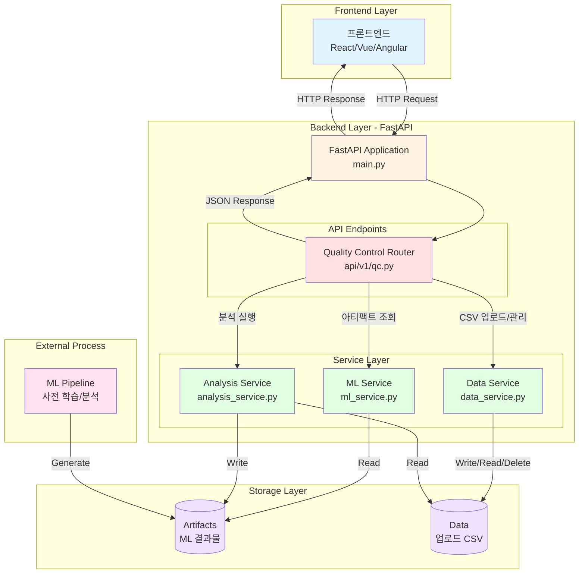

# 시스템 아키텍처 다이어그램

전해탈지 공정 품질 예측 백엔드 시스템의 전체 아키텍처를 나타냅니다.

## 주요 컴포넌트 설명

### 1. Frontend Layer
- 사용자 인터페이스
- 데이터 시각화 (차트, 그래프)
- 파일 업로드 UI
- CORS 허용 도메인: samsung-lac.vercel.app, localhost

### 2. Backend Layer - FastAPI
#### FastAPI Application (main.py)
- 애플리케이션 진입점
- CORS 미들웨어 설정
- 라우터 등록 및 관리

#### Quality Control Router (api/v1/qc.py)
**ML 아티팩트 조회 엔드포인트:**
- `GET /api/v1/feature-importance` - 특성 중요도
- `GET /api/v1/confusion-matrix` - 혼동 행렬
- `GET /api/v1/classification-report-rf` - 분류 리포트
- `GET /api/v1/safe-region` - 안전 구간 분석 결과

**데이터 관리 엔드포인트:**
- `POST /api/v1/upload-csv` - 단일 CSV 업로드
- `POST /api/v1/upload-multiple-csv` - 다중 CSV 업로드
- `GET /api/v1/sensor-files` - 센서 파일 목록 조회
- `DELETE /api/v1/sensor-files/{filename}` - 파일 삭제

**분석 실행 엔드포인트:**
- `POST /api/v1/start-analysis` - 백그라운드 분석 시작
- `GET /api/v1/analysis-status` - 분석 상태 조회

### 3. Service Layer
#### ML Service (ml_service.py)
- 사전 생성된 ML 아티팩트 파일 로딩
- CSV/JSON 파일을 Python dict로 변환
- 데이터 포맷 정규화

#### Data Service (data_service.py)
- CSV 파일 업로드 처리
- 센서 파일 분류 및 관리
- 파일 메타데이터 추출

#### Analysis Service (analysis_service.py)
- 전체 ML 파이프라인 실행 (백그라운드)
- 데이터 전처리 및 병합
- 모델 학습 및 평가
- EDA 리포트 생성

### 4. Storage Layer
#### Artifacts 디렉토리
사전 생성된 ML 결과물:
- `feature_importance_rf.csv` - RandomForest 특성 중요도
- `confusion_matrix_rf.csv` - 혼동 행렬 (2x2)
- `classification_report_rf.json` - 분류 메트릭
- `metrics_summary_randomforest.json` - 모델 성능 요약
- `safe_region_result.json` - 공정 안전 구간 분석
- `combined_data.csv` - 통합 데이터셋

#### Data 디렉토리
- 업로드된 센서 CSV 파일 저장
- 타임스탬프 기반 파일명 관리

### 5. External Process
#### ML Pipeline (외부)
- 데이터 전처리 및 정제
- 품질 평가 알고리즘
- RandomForest 모델 학습
- 안전 영역 분석
- 아티팩트 파일 생성 후 `artifacts/` 디렉토리에 저장

## 데이터 흐름

1. **아티팩트 조회 플로우:**
   프론트엔드 → FastAPI → QC Router → ML Service → Artifacts (읽기) → JSON 응답

2. **파일 업로드 플로우:**
   프론트엔드 → FastAPI → QC Router → Data Service → Data 디렉토리 (쓰기) → 응답

3. **분석 실행 플로우:**
   프론트엔드 → FastAPI → QC Router → Analysis Service (백그라운드) → Data (읽기) + Artifacts (쓰기)

## 기술 스택

- **프레임워크:** FastAPI
- **언어:** Python 3.13
- **데이터 처리:** Pandas
- **비동기 처리:** FastAPI BackgroundTasks
- **CORS:** FastAPI CORSMiddleware
