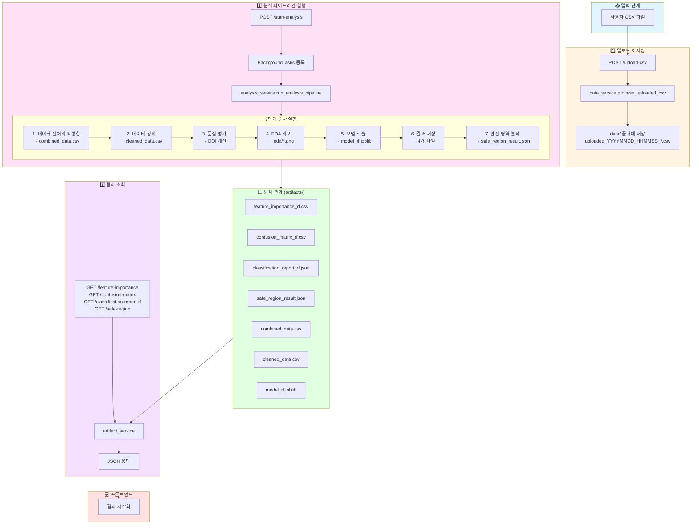
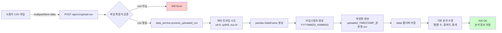
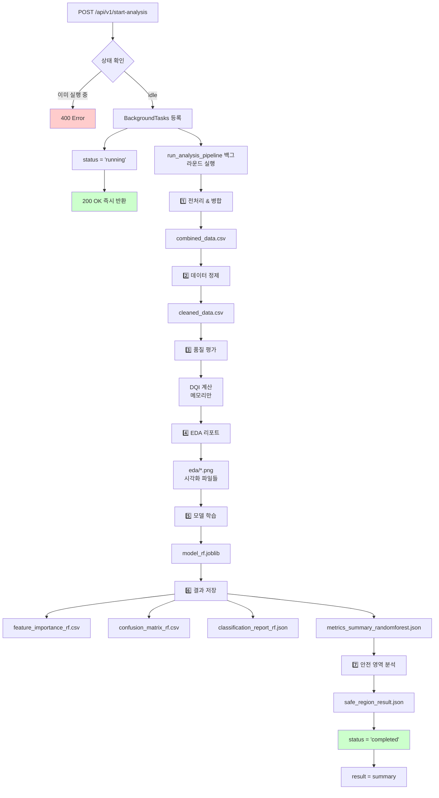
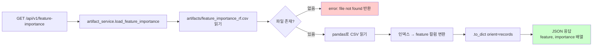
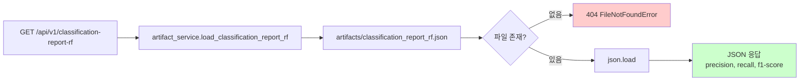
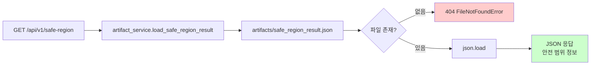
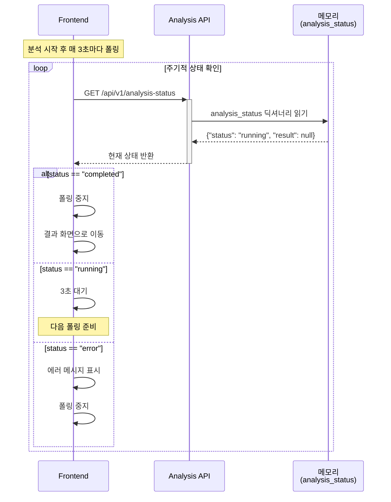
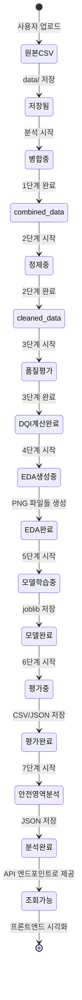

# 데이터 플로우 다이어그램

## 전체 데이터 흐름 개요



---

## 상세 데이터 플로우

### Flow 1: CSV 업로드 → data/ 저장



**데이터 변환:**
- 입력: Binary file (CSV)
- 중간: pandas DataFrame (메모리)
- 출력: CSV 파일 (data/uploaded_YYYYMMDD_HHMMSS_원본명.csv)

---

### Flow 2: 분석 실행 → artifacts/ 생성



**데이터 변환 상세:**

| 단계 | 입력 | 처리 | 출력 |
|-----|------|------|------|
| 1. 전처리 | data/*.csv 여러 파일 | 컬럼 정규화, 병합 | combined_data.csv |
| 2. 정제 | combined_data.csv | 결측치 제거, Z-score 이상치 제거 | cleaned_data.csv |
| 3. 품질 평가 | cleaned_data.csv | DQI 계산 (0~1 점수) | 메모리 (파일 저장 안함) |
| 4. EDA | cleaned_data.csv | matplotlib 시각화 | eda/*.png (5~10개 그래프) |
| 5. 모델 학습 | cleaned_data.csv | RandomForest 학습 | model_rf.joblib, scaler.joblib |
| 6. 평가 결과 | 학습 완료 모델 | 예측 & 평가 메트릭 | 4개 CSV/JSON 파일 |
| 7. 안전 영역 | 학습 완료 모델 | 격자점 예측 & 영역 추정 | safe_region_result.json |

---

### Flow 3: 결과 조회 → JSON 응답








**데이터 변환:**
- CSV 파일 → pandas DataFrame → Python dict → JSON
- JSON 파일 → Python dict → JSON (그대로 전달)

---

### Flow 4: 상태 조회 (폴링)



**상태 데이터 구조:**
```json
{
  "status": "idle | running | completed | error",
  "result": null | {
    "status": "success",
    "data_summary": {...},
    "model": {...},
    "safe_region": {...}
  }
}
```

---

## 파일 생성 타임라인

분석 파이프라인 실행 시 파일들이 생성되는 순서와 예상 소요 시간:

```
t=0s     │ POST /start-analysis 호출
         │ └─ 200 OK 즉시 반환
         │
t=0~5s   │ 🔄 1단계: 전처리 & 병합
         │ └─ artifacts/combined_data.csv 생성
         │
t=5~10s  │ 🔄 2단계: 데이터 정제
         │ └─ artifacts/cleaned_data.csv 생성
         │
t=10~15s │ 🔄 3단계: 품질 평가
         │ └─ (파일 생성 없음, 메모리만)
         │
t=15~30s │ 🔄 4단계: EDA 리포트
         │ └─ artifacts/eda/*.png (여러 파일)
         │
t=30~50s │ 🔄 5단계: 모델 학습
         │ └─ artifacts/model_rf.joblib
         │ └─ artifacts/scaler.joblib
         │
t=50~55s │ 🔄 6단계: 평가 결과 저장
         │ ├─ artifacts/feature_importance_rf.csv
         │ ├─ artifacts/confusion_matrix_rf.csv
         │ ├─ artifacts/classification_report_rf.json
         │ └─ artifacts/metrics_summary_randomforest.json
         │
t=55~65s │ 🔄 7단계: 안전 영역 분석
         │ └─ artifacts/safe_region_result.json
         │
t=65s    │ ✅ 분석 완료
         │ └─ status = "completed"
```

**총 소요 시간**: 약 60~90초 (데이터 크기에 따라 변동)

---

## 데이터 생명주기 상태 다이어그램



---

## 저장소별 역할

| 저장소 | 경로 | 용도 | 생성 시점 | 소비 주체 |
|--------|------|------|----------|-----------|
| **원본 데이터** | `data/uploaded_*.csv` | 사용자 업로드 CSV | 업로드 API 호출 시 | analysis_service |
| **병합 데이터** | `artifacts/combined_data.csv` | 여러 센서 데이터 병합 | 분석 1단계 | 분석 2~7단계 |
| **정제 데이터** | `artifacts/cleaned_data.csv` | 결측치/이상치 제거 | 분석 2단계 | 분석 3~7단계 |
| **시각화** | `artifacts/eda/*.png` | 탐색적 데이터 분석 | 분석 4단계 | (프론트 직접 조회 가능) |
| **모델** | `artifacts/model_rf.joblib` | 학습된 RandomForest | 분석 5단계 | 분석 7단계 (안전 영역) |
| **평가 결과** | `artifacts/*_rf.{csv,json}` | 모델 성능 메트릭 | 분석 6단계 | artifact_service → API |
| **안전 영역** | `artifacts/safe_region_result.json` | 공정 안전 파라미터 | 분석 7단계 | artifact_service → API |
| **상태 정보** | 메모리 (analysis_status) | 분석 실행 상태 | 분석 시작/완료 | Analysis API |

---

## 데이터 변환 요약

### 인코딩 & 파싱
- **입력**: Binary CSV file
- **처리**:
  1. UTF-8 시도
  2. CP949 시도 (한글 Windows)
  3. EUC-KR 시도 (레거시 한글)
- **출력**: pandas DataFrame

### 정규화 & 병합
- **입력**: 여러 센서 CSV 파일들
- **처리**:
  1. 컬럼명 정규화 (소문자, 공백 제거)
  2. 타임스탬프 기준 병합
  3. 중복 제거
- **출력**: combined_data.csv (단일 DataFrame)

### 정제
- **입력**: combined_data.csv
- **처리**:
  1. 결측치 행 제거
  2. Z-score > 3 이상치 제거
  3. 인덱스 리셋
- **출력**: cleaned_data.csv

### ML 학습
- **입력**: cleaned_data.csv
- **처리**:
  1. train_test_split (80:20)
  2. StandardScaler 적용
  3. RandomForestClassifier 학습
- **출력**:
  - model_rf.joblib (모델)
  - scaler.joblib (스케일러)
  - 예측 결과 (메모리)

### 평가 메트릭
- **입력**: 예측 결과 (y_test vs y_pred)
- **처리**:
  1. confusion_matrix 계산
  2. classification_report 생성
  3. feature_importances_ 추출
- **출력**:
  - CSV (confusion matrix, feature importance)
  - JSON (classification report, metrics summary)

### 안전 영역 추정
- **입력**: 학습된 모델
- **처리**:
  1. 주요 특성 2개 선택
  2. 격자점 생성 (100x100)
  3. 각 격자점 예측
  4. "정상" 예측 영역 계산
- **출력**: safe_region_result.json
  - 안전 범위 (min/max)
  - 중심점
  - 영역 비율

### API 응답 변환
- **CSV → JSON**:
  - pandas → `.to_dict(orient="records")`
  - 의미론적 키로 매핑
- **JSON → JSON**:
  - 파일 그대로 전달
  - 추가 변환 없음

---

## 다이어그램 렌더링 방법

### 1. GitHub에서 보기
- 이 파일을 GitHub에 push하면 자동으로 렌더링됩니다

### 2. VS Code에서 보기
- Mermaid 플러그인 설치: `Markdown Preview Mermaid Support`
- 마크다운 미리보기 열기 (Cmd+Shift+V)

### 3. 온라인 에디터
- https://mermaid.live/ 에서 코드 붙여넣기
