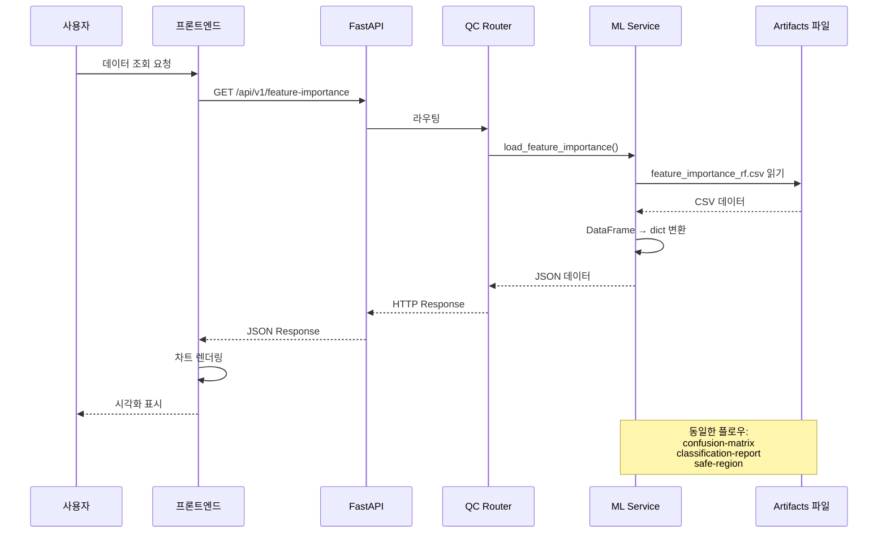
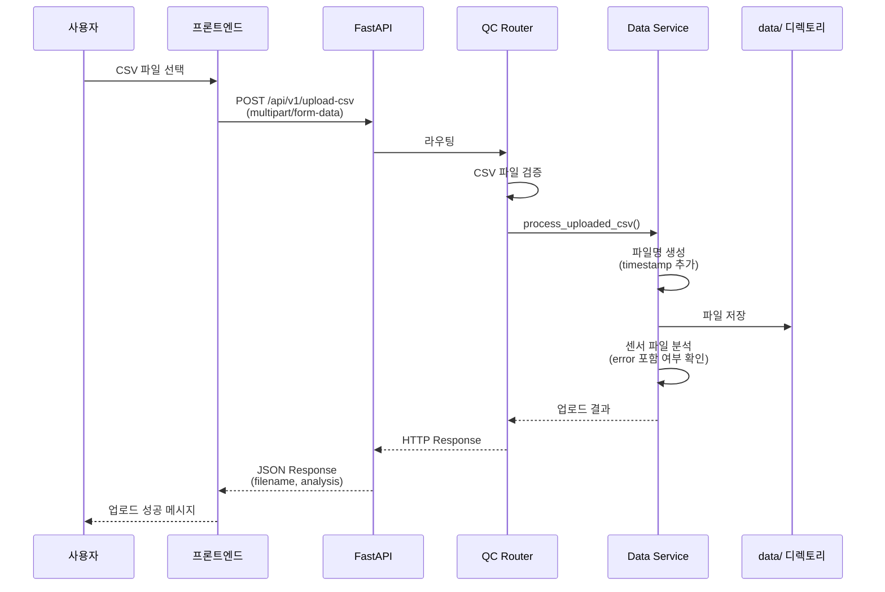
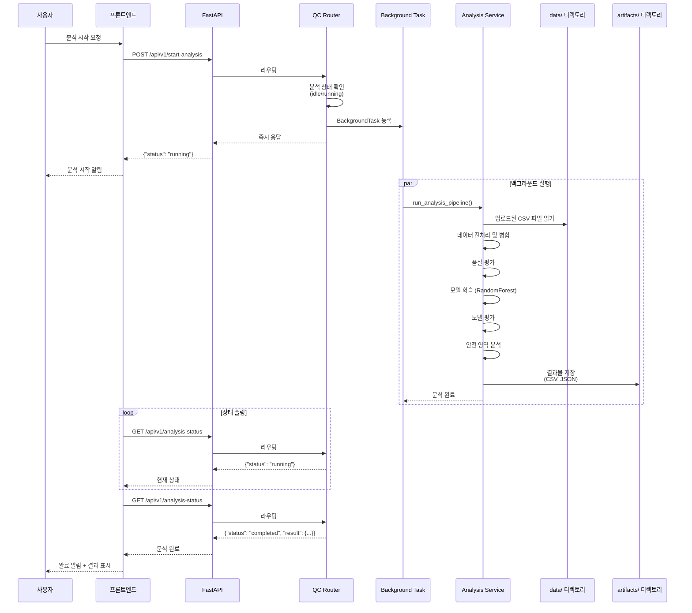
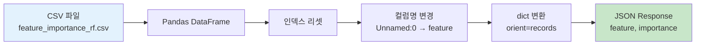
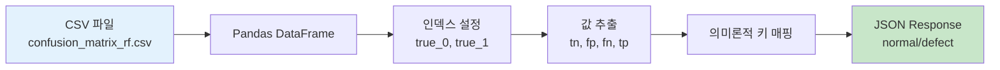
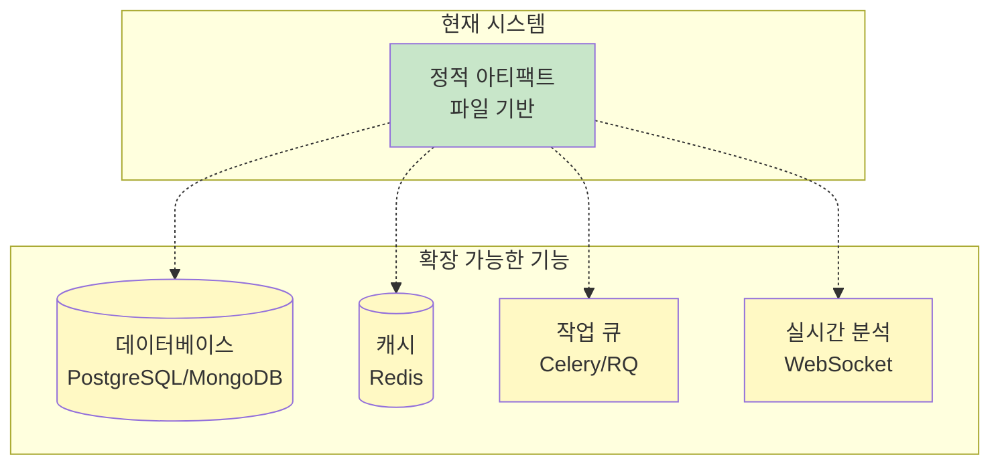

# 데이터 플로우 다이어그램

전해탈지 공정 데이터가 수집되어 ML 분석을 거쳐 최종 사용자에게 전달되는 전체 흐름을 나타냅니다.

## 1. 전체 데이터 파이프라인

```mermaid
flowchart LR
    subgraph "데이터 수집"
        RAW[원본 센서 데이터<br/>CSV 파일]
        ERROR[에러 로그<br/>CSV 파일]
    end

    subgraph "데이터 업로드 (백엔드)"
        UPLOAD[파일 업로드<br/>POST /upload-csv]
        STORAGE[(data/ 디렉토리)]
    end

    subgraph "ML Pipeline (외부/백그라운드)"
        PREPROCESS[데이터 전처리<br/>병합 및 정제]
        QUALITY[품질 평가<br/>불량/정상 분류]
        TRAIN[모델 학습<br/>RandomForest]
        EVAL[모델 평가<br/>성능 분석]
        SAFE[안전 영역 분석<br/>공정 최적화]
    end

    subgraph "Artifacts 저장"
        ART[(artifacts/<br/>ML 결과물)]
    end

    subgraph "API 서비스"
        API[FastAPI 백엔드<br/>GET /api/v1/*]
    end

    subgraph "데이터 시각화"
        DASH[프론트엔드<br/>대시보드]
        CHART[차트/그래프<br/>인사이트]
    end

    %% 데이터 흐름
    RAW --> UPLOAD
    ERROR --> UPLOAD
    UPLOAD --> STORAGE

    STORAGE --> PREPROCESS
    PREPROCESS --> QUALITY
    QUALITY --> TRAIN
    TRAIN --> EVAL
    EVAL --> SAFE
    SAFE --> ART

    ART --> API
    API --> DASH
    DASH --> CHART

    style RAW fill:#e3f2fd
    style ERROR fill:#ffebee
    style UPLOAD fill:#fff3e0
    style STORAGE fill:#f3e5f5
    style PREPROCESS fill:#e8f5e9
    style QUALITY fill:#e8f5e9
    style TRAIN fill:#e8f5e9
    style EVAL fill:#e8f5e9
    style SAFE fill:#e8f5e9
    style ART fill:#fff9c4
    style API fill:#ffe0b2
    style DASH fill:#e1f5fe
    style CHART fill:#e1f5fe
```



## 2. API 요청 플로우 (상세)

### 2.1 ML 아티팩트 조회 플로우



### 2.2 CSV 파일 업로드 플로우



### 2.3 백그라운드 분석 실행 플로우



## 3. 데이터 변환 과정

### 3.1 특성 중요도 (Feature Importance)



**예시 변환:**
```
CSV:                        JSON:
Unnamed: 0, importance  →  [
current, 0.45              {"feature": "current", "importance": 0.45},
voltage, 0.32              {"feature": "voltage", "importance": 0.32},
temp, 0.23                 {"feature": "temp", "importance": 0.23}
                           ]
```

### 3.2 혼동 행렬 (Confusion Matrix)



**예시 변환:**
```
CSV:                          JSON:
       pred_0  pred_1     →  {
true_0   850     15           "normal_to_normal": 850,
true_1    12     98           "normal_to_defect": 15,
                              "defect_to_normal": 12,
                              "defect_to_defect": 98
                             }
```

## 4. 주요 데이터 파일

### Artifacts 디렉토리 (ML 결과물)
| 파일명 | 형식 | 용도 | 크기 |
|--------|------|------|------|
| `feature_importance_rf.csv` | CSV | 특성 중요도 점수 | ~1KB |
| `confusion_matrix_rf.csv` | CSV | 혼동 행렬 (2x2) | <1KB |
| `classification_report_rf.json` | JSON | 분류 메트릭 (정밀도, 재현율, F1) | ~2KB |
| `metrics_summary_randomforest.json` | JSON | 모델 성능 요약 | ~1KB |
| `safe_region_result.json` | JSON | 공정 안전 구간 분석 | ~5KB |
| `combined_data.csv` | CSV | 통합 데이터셋 | 425KB |

### Data 디렉토리 (업로드 파일)
- 패턴: `uploaded_YYYYMMDD_HHMMSS_원본파일명.csv`
- 센서 파일: 파일명에 'error' 미포함
- 에러 파일: 파일명에 'error' 포함

## 5. 데이터 처리 특징

### 서비스 레이어 패턴
모든 아티팩트 로딩 함수는 일관된 패턴:
1. `artifacts/` 디렉토리에서 파일 읽기
2. 파일 없을 시 적절한 에러 처리 (`FileNotFoundError` 또는 에러 딕셔너리)
3. JSON 직렬화 가능한 dict 형태로 반환

### 데이터 정규화
- CSV 파일의 인덱스 컬럼 처리
- 의미론적 키 이름 사용 (true_0 → normal_to_normal)
- 프론트엔드 친화적 형식 변환

### 파일 명명 규칙
- 타임스탬프 기반 고유 파일명
- 원본 파일명 보존
- 파일 타입별 분류 (센서/에러)

## 6. 확장 가능성

현재 시스템은 다음과 같은 확장이 가능합니다:


