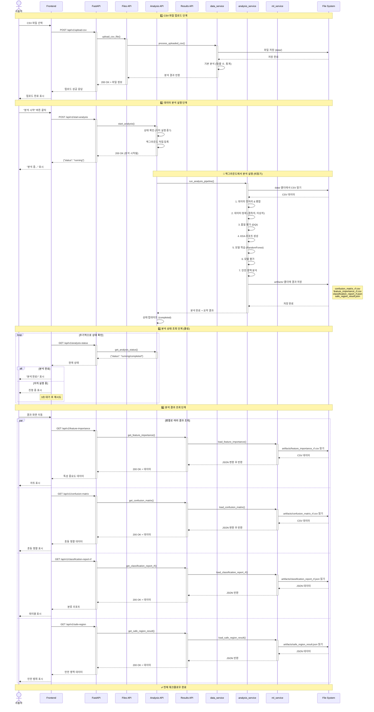
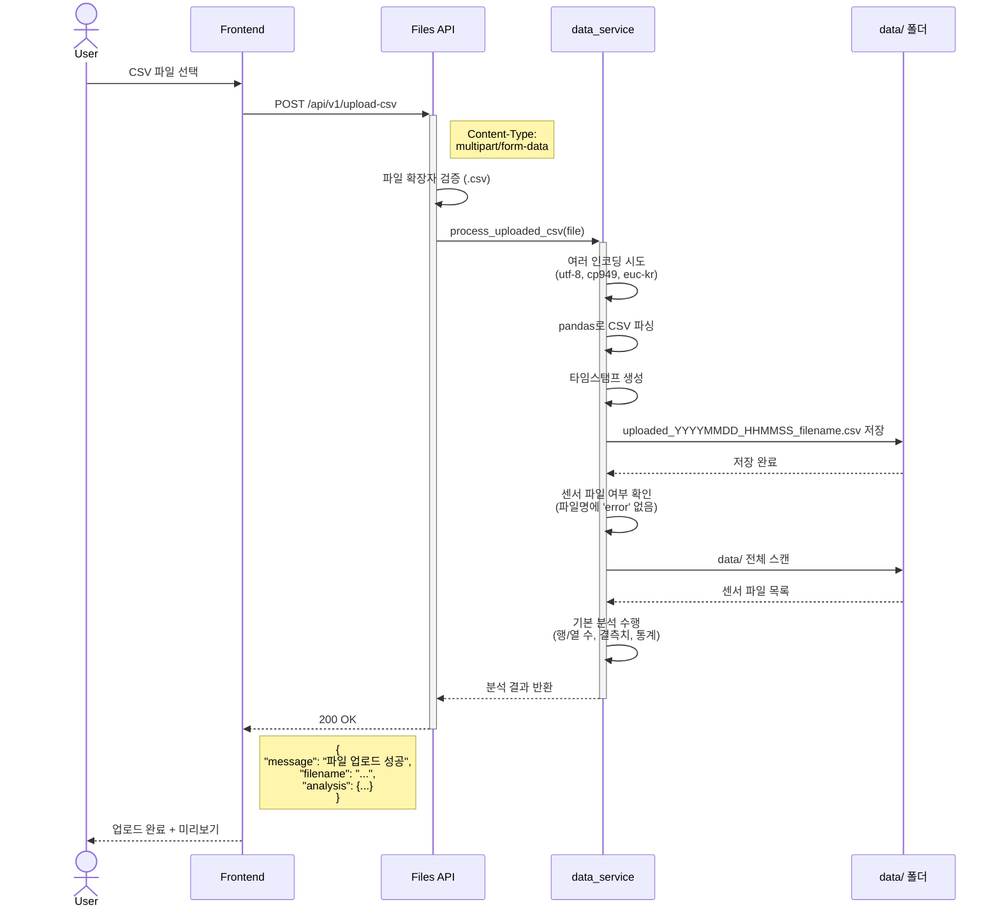
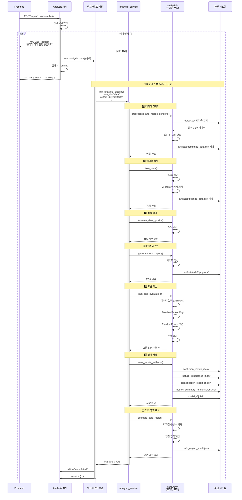
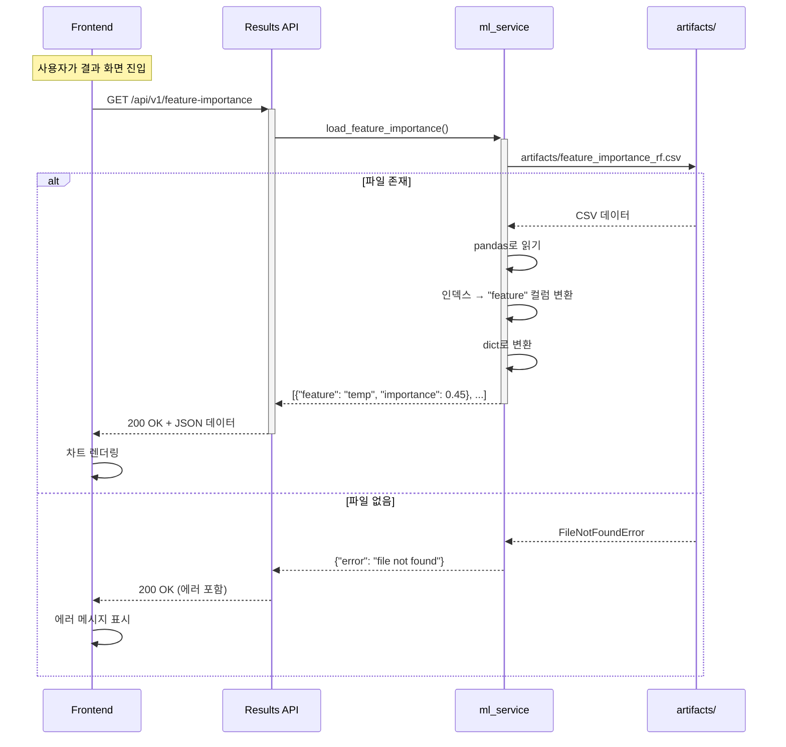
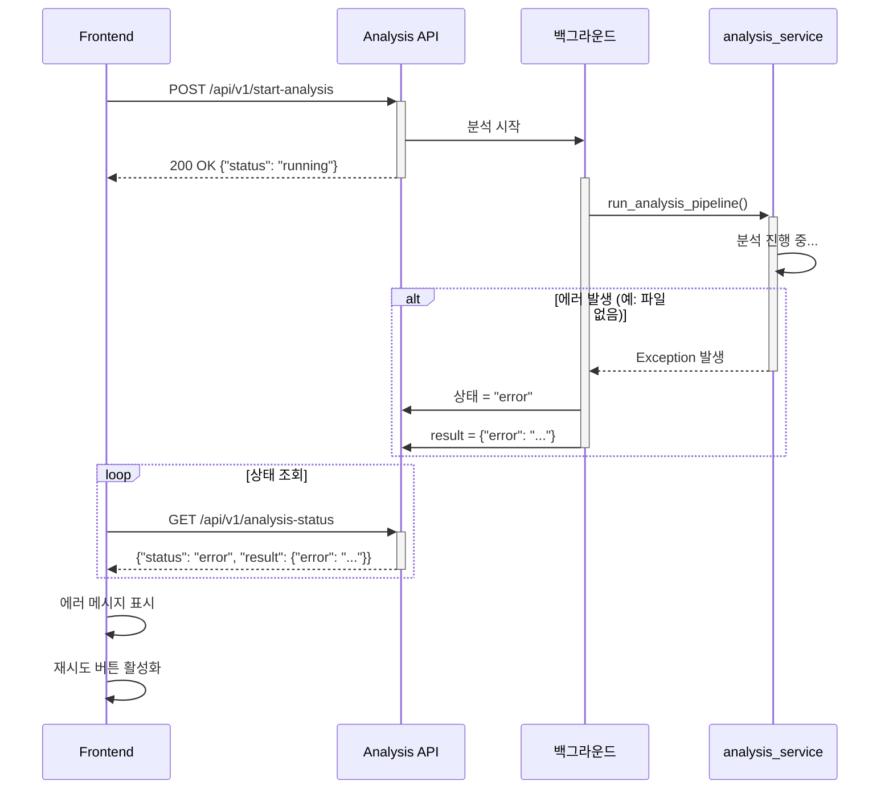

# 시퀀스 다이어그램

## 전체 워크플로우: CSV 업로드부터 결과 조회까지



---

## 상세 시퀀스 다이어그램 (개별)

### 1. CSV 업로드 플로우



### 2. 분석 실행 플로우 (백그라운드)



### 3. 결과 조회 플로우



---

## 에러 처리 플로우



---

## 다이어그램 렌더링 방법

### 1. GitHub에서 보기
- 이 파일을 GitHub에 push하면 자동으로 렌더링됩니다

### 2. VS Code에서 보기
- Mermaid 플러그인 설치: `Markdown Preview Mermaid Support`
- 마크다운 미리보기 열기 (Cmd+Shift+V)

### 3. 온라인 에디터
- https://mermaid.live/ 에서 코드 붙여넣기

### 4. 이미지로 변환
```bash
# mermaid-cli 설치
npm install -g @mermaid-js/mermaid-cli

# PNG로 변환
mmdc -i sequence-diagram.md -o sequence-diagram.png
```
