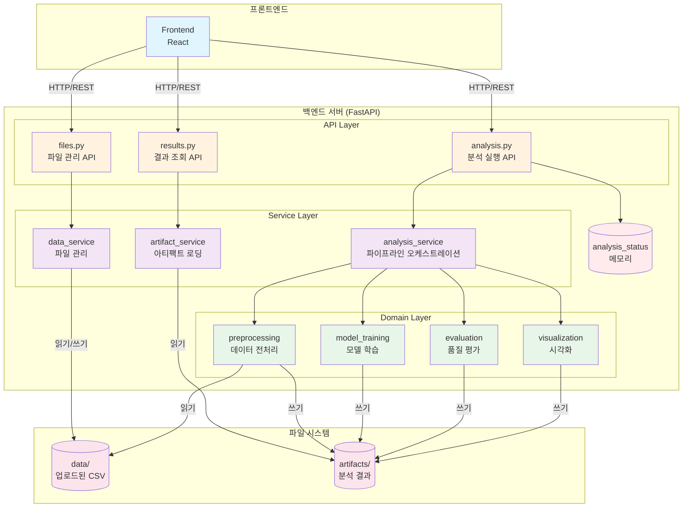
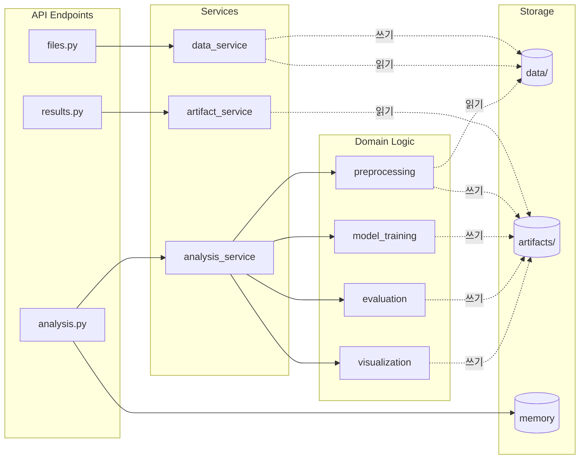
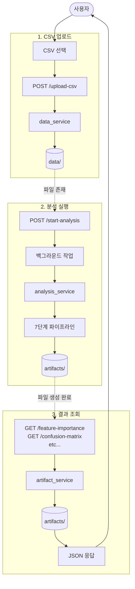

# 시스템 아키텍처

## 전체 시스템 구조



---

## 계층형 아키텍처

```
┌─────────────────────────────────────────────────────────────┐
│                       Frontend Layer                        │
│                    (React/Vue on Vercel)                    │
└────────────────────────┬────────────────────────────────────┘
                         │ HTTP/REST API
                         │ /api/v1/*
┌────────────────────────┴────────────────────────────────────┐
│                       API Layer                             │
│  ┌──────────────┐  ┌──────────────┐  ┌──────────────┐     │
│  │ results.py   │  │  files.py    │  │ analysis.py  │     │
│  │ (결과 조회)   │  │ (파일 관리)   │  │ (분석 실행)   │     │
│  │              │  │              │  │              │     │
│  │ GET /feature-│  │ POST /upload-│  │ POST /start- │     │
│  │ importance   │  │ csv          │  │ analysis     │     │
│  │ GET /confusion│ │ DELETE /files│  │ GET /status  │     │
│  └──────┬───────┘  └──────┬───────┘  └──────┬───────┘     │
└─────────┼──────────────────┼──────────────────┼─────────────┘
          │                  │                  │
┌─────────┼──────────────────┼──────────────────┼─────────────┐
│         │    Service Layer │                  │             │
│  ┌──────▼────────┐  ┌──────▼────────┐  ┌──────▼────────┐  │
│  │ artifact_     │  │ data_         │  │ analysis_     │  │
│  │ service       │  │ service       │  │ service       │  │
│  │               │  │               │  │               │  │
│  │ - 아티팩트    │  │ - CSV 업로드  │  │ - 파이프라인  │  │
│  │   로딩        │  │ - 파일 저장   │  │   실행        │  │
│  │ - JSON 변환   │  │ - 파일 삭제   │  │ - 결과 요약   │  │
│  └───────────────┘  └───────────────┘  └──────┬────────┘  │
└─────────────────────────────────────────────────┼───────────┘
                                                  │
┌─────────────────────────────────────────────────┼───────────┐
│                  Domain Layer                   │           │
│  ┌──────────────┐  ┌──────────────┐  ┌─────────▼──────┐   │
│  │preprocessing │  │model_training│  │  evaluation    │   │
│  │- 데이터 병합  │  │- 모델 학습   │  │ - 품질 평가    │   │
│  │- 데이터 정제  │  │- 결과 저장   │  │ - 안전 영역    │   │
│  └──────────────┘  └──────────────┘  └────────────────┘   │
│  ┌──────────────┐                                          │
│  │visualization │                                          │
│  │- EDA 리포트  │                                          │
│  │- 차트 생성   │                                          │
│  └──────────────┘                                          │
└───────────┬─────────────────┬────────────────────────────────┘
            │                 │
┌───────────▼─────────────────▼──────────────────────────────┐
│                   File System Layer                        │
│  ┌──────────────────────┐  ┌──────────────────────────┐   │
│  │ data/                │  │ artifacts/               │   │
│  │                      │  │                          │   │
│  │ uploaded_*.csv       │  │ confusion_matrix_rf.csv  │   │
│  │                      │  │ feature_importance_rf.csv│   │
│  │                      │  │ classification_report.json│  │
│  │                      │  │ safe_region_result.json  │   │
│  │                      │  │ model_rf.joblib          │   │
│  └──────────────────────┘  └──────────────────────────┘   │
└────────────────────────────────────────────────────────────┘

                    ┌──────────────────┐
                    │ analysis_status  │
                    │   (메모리)       │
                    └──────────────────┘
```

---

## 컴포넌트 간 관계도



---

## 3가지 주요 플로우

### 1️⃣ CSV 업로드 플로우

```
Frontend
   │
   │ POST /api/v1/upload-csv
   ↓
files.py (API)
   │
   │ process_uploaded_csv()
   ↓
data_service
   │
   │ - 인코딩 감지
   │ - pandas 파싱
   │ - 타임스탬프 생성
   ↓
data/ 폴더에 저장
   │
   │ uploaded_YYYYMMDD_HHMMSS_filename.csv
   ↓
200 OK 응답
```

### 2️⃣ 분석 실행 플로우

```
Frontend
   │
   │ POST /api/v1/start-analysis
   ↓
analysis.py (API)
   │
   │ - 상태 확인 (이미 실행 중?)
   │ - 백그라운드 작업 등록
   ↓
즉시 200 OK 반환
   │
   │ {"status": "running"}
   ↓
[백그라운드 실행]
   │
   ↓
analysis_service.run_full_pipeline()
   │
   ├─> preprocessing → data/ 읽기 → artifacts/ 쓰기
   ├─> model_training → artifacts/ 쓰기
   ├─> evaluation → artifacts/ 쓰기
   └─> visualization → artifacts/ 쓰기
   │
   ↓
analysis_status 업데이트
   │
   │ {"status": "completed", "result": {...}}
   ↓
Frontend 폴링으로 상태 확인
```

### 3️⃣ 결과 조회 플로우

```
Frontend
   │
   │ GET /api/v1/feature-importance
   ↓
results.py (API)
   │
   │ load_feature_importance()
   ↓
artifact_service
   │
   │ - CSV 읽기
   │ - JSON 변환
   ↓
artifacts/ 폴더에서 읽기
   │
   │ feature_importance_rf.csv
   ↓
200 OK + JSON 데이터
```

---

## 데이터 흐름도



---

## 디렉토리 구조

```
capstone2_BE/
├── app/
│   ├── main.py                     # FastAPI 엔트리포인트
│   │
│   ├── api/v1/                     # API Layer
│   │   ├── results.py              # 결과 조회 (4개 엔드포인트)
│   │   ├── files.py                # 파일 관리 (4개 엔드포인트)
│   │   └── analysis.py             # 분석 실행 (2개 엔드포인트)
│   │
│   ├── services/                   # Service Layer
│   │   ├── artifact_service.py     # artifacts 로딩
│   │   ├── data_service.py         # 파일 관리
│   │   └── analysis_service.py     # 파이프라인 오케스트레이션
│   │
│   └── analysis/                   # Domain Layer
│       ├── preprocessing.py        # 데이터 전처리
│       ├── model_training.py       # 모델 학습
│       ├── evaluation.py           # 품질 평가
│       └── visualization.py        # 시각화
│
├── data/                           # 업로드된 CSV 파일
│   └── uploaded_*.csv
│
└── artifacts/                      # 분석 결과 파일
    ├── combined_data.csv
    ├── cleaned_data.csv
    ├── confusion_matrix_rf.csv
    ├── feature_importance_rf.csv
    ├── classification_report_rf.json
    ├── safe_region_result.json
    ├── model_rf.joblib
    └── eda/
        ├── histogram.png
        ├── correlation_heatmap.png
        └── ...
```

---

## API 엔드포인트 구조

```
/api/v1/
│
├── 📊 Results (분석 결과 조회)
│   ├── GET /feature-importance
│   ├── GET /confusion-matrix
│   ├── GET /classification-report-rf
│   └── GET /safe-region
│
├── 📁 Files (파일 관리)
│   ├── POST /upload-csv
│   ├── POST /upload-multiple-csv
│   ├── GET /sensor-files
│   └── DELETE /sensor-files/{filename}
│
└── 🔬 Analysis (분석 실행/상태)
    ├── POST /start-analysis
    └── GET /analysis-status
```

---

## 기술 스택

```
┌─────────────────────────────────────┐
│ Frontend                            │
│ - React/Vue.js                      │
│ - Axios (HTTP Client)               │
│ - Vercel (배포)                     │
└─────────────────────────────────────┘
                  ↕ REST API
┌─────────────────────────────────────┐
│ Backend                             │
│ - Python 3.13                       │
│ - FastAPI                           │
│ - Uvicorn (ASGI Server)             │
└─────────────────────────────────────┘
                  ↕
┌─────────────────────────────────────┐
│ Data Processing                     │
│ - pandas (데이터 처리)               │
│ - scikit-learn (ML)                 │
│ - matplotlib/seaborn (시각화)       │
└─────────────────────────────────────┘
                  ↕
┌─────────────────────────────────────┐
│ Storage                             │
│ - File System (data/, artifacts/)  │
│ - Memory (analysis_status)          │
└─────────────────────────────────────┘
```

---

## 설계 패턴

### 1. **계층형 아키텍처 (Layered Architecture)**

```
API Layer → Service Layer → Domain Layer → Storage
```

### 2. **관심사의 분리 (Separation of Concerns)**

- **results.py**: 조회만
- **files.py**: 파일 관리만
- **analysis.py**: 분석 실행만

### 3. **단일 책임 원칙 (Single Responsibility)**

- **artifact_service**: 읽기 전용
- **data_service**: 파일 관리
- **analysis_service**: 파이프라인 조율

### 4. **의존성 방향**

```
API → Service → Domain → Storage
(상위 계층이 하위 계층에만 의존)
```

---

## 확장 가능성

### 현재 구조의 장점

✅ API 버전 관리 (`/api/v1/`)
✅ 모듈화된 서비스
✅ 명확한 책임 분리
✅ 테스트 용이

### 향후 개선 방안

🔄 Redis로 상태 관리 (메모리 → Redis)
🔄 PostgreSQL로 메타데이터 관리
🔄 S3로 파일 저장 (파일 시스템 → 클라우드)
🔄 Celery로 비동기 작업 큐
🔄 Docker 컨테이너화

---

## 요약

| 레이어      | 역할            | 구성 요소                                                |
| ----------- | --------------- | -------------------------------------------------------- |
| **API**     | 엔드포인트 정의 | results.py, files.py, analysis.py                        |
| **Service** | 비즈니스 로직   | artifact_service, data_service, analysis_service         |
| **Domain**  | 도메인 로직     | preprocessing, model_training, evaluation, visualization |
| **Storage** | 데이터 저장     | data/, artifacts/, memory                                |

**핵심 원칙**: 각 레이어는 **명확한 책임**을 가지며, **상위 레이어만 하위 레이어에 의존**합니다.
